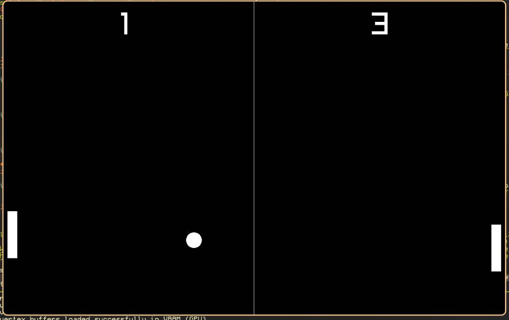

# Pong using Raylib
## Overview 
- Pong vs Computer(right paddle).
- Keeps track of scores.
## To run the game 
- If not using nix you will need to install raylib.
- Then you can `cmake -B build` and then `cmake --build build && ./build/pong_raylib`
## Screenshot 

